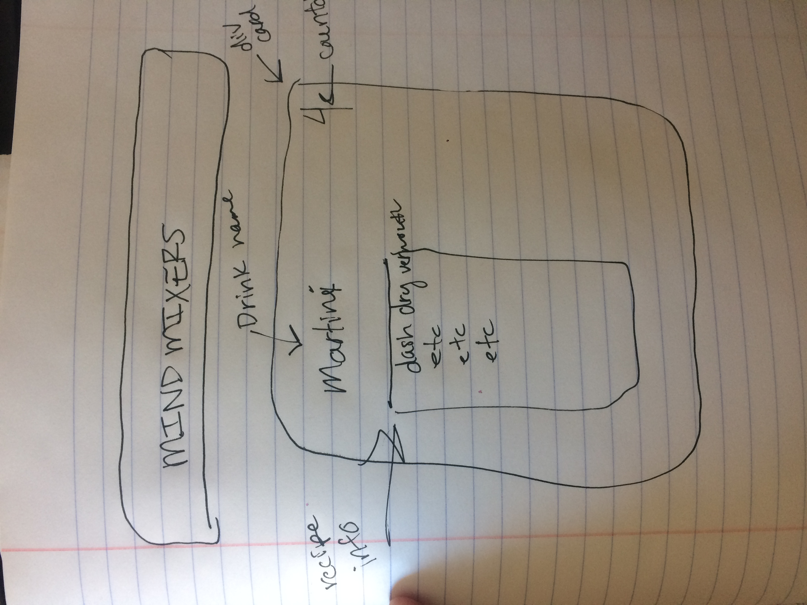

# Project1

# PROJECT 1: Mind Mixers

The README.md file in the top level of your repo should have an explanation of what the project is and why you made it, your user stories and wireframes, explanations of the technologies used and the approaches taken, installation instructions, unsolved problems, and forthcoming features.

## What this game is about:
This is a memory game and multiple choice quiz in one that builds your knowledge of classic cocktails. It puts a series of cards that belong to a particular "round" on the user's screen with seconds on the countdown clock allowing the user look over the information. After the cards have shuffled through, the user is then presented with multiple choice questions, or in one instance, there will be an input field to earn points. Only if the user gets a perfect score, do they win the game. I made this game, because I thought it would be fun and informative for the user to play.

## Technology
I used jQuery extensively. I styled my project with CSS to make the experience more enjoyable and engaging. I employed divs, images, and audio. I also utilized input fields. I also use arrays of objects to store my questions and answers.   

## User Stories
--User loads the page and sees the rules of the game in the modale box. This includes that there will be five rounds. What topics the rounds cover is also displayed in the modale box. The box stays up to give the user plenty of time to read the rules and when they click the "Start Game" button, the modale closes and mellow, jazz stock music starts to indicate that the game is starting. 
--A div card pops up on the screen and a countdown is initiated. This is the start of the first round. 3 divs shuffle through and afterwards a div box with a multiple choice question pops up on the screen. This "multiple choice question div" does not have a timer. The user makes their selection by clicking a button with an answer selection appended to it. When they click their selection the buttons, will have a background-color that indicates with a green color what answer is correct and a pink color with answer selections that are false. One point will be awarded for every correct selection. 
--After the first round, the second round deploys with a recipe card div for the margarita cocktail with a countdown clock on the div. When the countdown clock gets to 0, the margarita div disappears and a multiple choice question pops up with four selections. The user makes a selection and has an indication whether they made the right selection or not by the background-color changing to green or pink. 
--The "Old Fashioned" cocktail div deploys with a countdown timer. When the timer get to zero, another div appears requesting the user to input in numbered input fields the ingredients that go into an Old Fashioned in the correct order. This div has the ingredients listed on it, out-of-order. For every correct input, the user is awarded a point. An alert pops up telling the user how many points they have. 
--When the user clicks ok, The Manhattan round of divs deploys, four divs in total following one after the other when the previous div's countdown has gotten down to zero. Then another round of multiple choice questions deploys as it has before, testing the users memory under more pressure. A point is award for every correct answer.
--Now, the Martini round of div deploys, one following after another. There are six divs for this roumd as opposed to four in the Manhattan round. After the divs have shuffled through and before the multiple choice questions are presented, an alert will pop up telling the user if they have earned enough points from the game to unlock the 50/50 round for the Martini section. There are six questions in a row with nuanced differences between the answers which make the 50/50 option extremely appealing. If the user hasn't accrued enough points, they are alerted by the game that they do not have enough points to unlock the 50/50 round. After answering the multiple choice questions the user is alerted to whether or not they won the game!

## Wireframe
